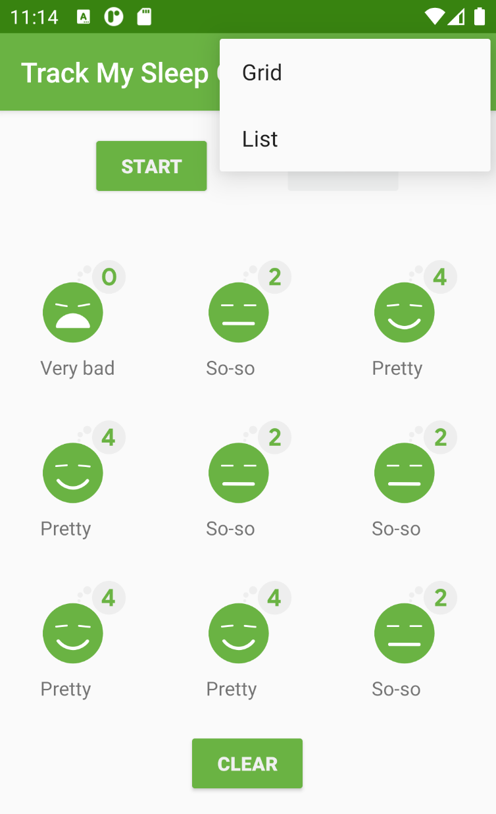

# RecyclerView - SleepQualityTracker with RecyclerView app

This is the toy app for Lesson 7 of the [Android App Development in Kotlin course on Udacity](https://classroom.udacity.com/courses/ud9012/).

## Note
This app was extended beyond the course requirements and added support for multiple recycler view layout managers (linear and grid) with slightly altered UI and animation.

## SleepQualityTracker with RecyclerView

This app builds on the SleepQualityTracker you developed in Lesson 6.  In this lesson you'll learn how to display a list of results in a RecyclerView instead of a static ScrollView. You'll also learn how you can refactor your code to make it more efficient so it will be easier to maintain and test.

## Original Screenshots

## Original Repo
https://github.com/udacity/andfun-kotlin-sleep-tracker-with-recyclerview